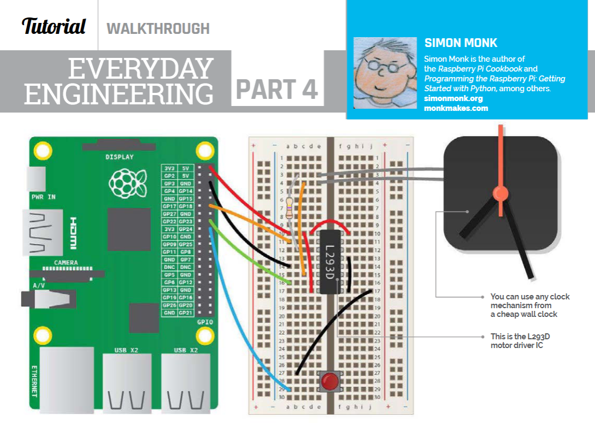
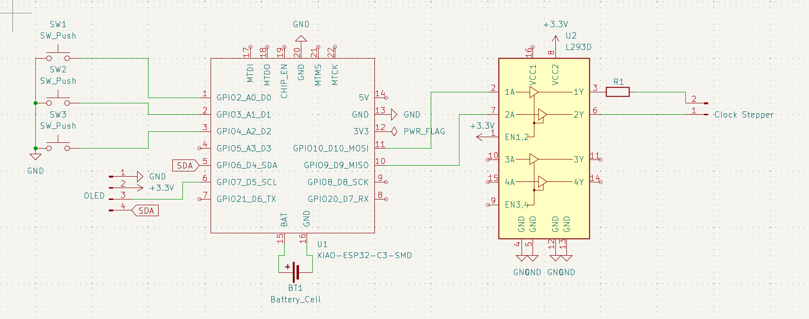

## 7_9_2025

30m Begin!
  I have a clock motor laying around (for an analog mounted wall clock). The ideas is hacking it to do whatever I want. Mode 1 is regular clock. Then, if you press start, it runs like a watch chronometer.

  I found a similar project using a Rasberry Pi made by Simon Monk, and plan to use his wiring diagram as a starting point:

## 7_12_2025 

45m Sketch the schematic
  Motor controllers are weird. The wiring diagram I'm going off had several extra traces I don't need (they're for an extra switch he was using). Once I figured that out, I read some articles about H-bridges to figure out the motor controller and drew the traces.

  The switches are a one-row matrix to save space.

30m Read the ESP32-C3 datasheet.
  The datasheet said the ESP32-C3 didn't have an internal clock, so I asked on the Slack. @luteron6 helped out - I was reading the schematic for the chip itself and not the module. Since the module has a clock, I can continue on.

## 7_13_2025

1.5h Make the schematic.
  Learned a couple helpful things. Headers are called Conn pins, and that's what I used for the OLED and clock input.
  

1h Motor controller swap
  I was putting off figuring out how to jump from the 3V3 to the 5V for the L293D. I *could* add some components to raise the voltage. But since the clock stepper is a Lavet-type stepper motor, it likely draws 1.5 volts, so raising, then lowering, the voltage isn't useful. Instead I'm going to use the ChatGPT recommended DRV8833 which operates down to 2.7V due to the MOSFET.