> 📘 Total Time:  33.5 hours

#### 7_3_2025 Design key layout

*1.2h* I want this to be a very small, BLE enabled, battery powered keyboard. I like the Drop Alt board design, so I'm aiming for something like that.

Getting full arrow keys (where the up/down keys aren't .5u tall) wreaks havoc with spacing. I got rid of the right shift key. 

Having func keys tertiary to the num row is fine, but I want a completely seperate esc and del key, so dropped those on the right near the arrow keys. In a final version those might just be macros.

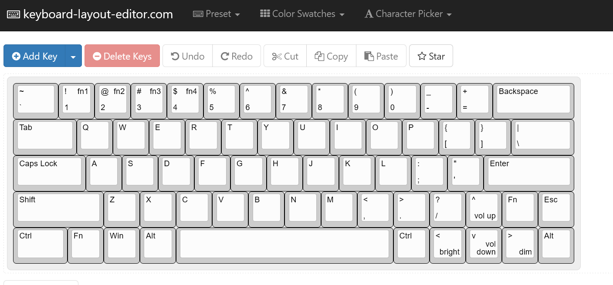

---

#### 7_15_2025 Schematic + PCB V1

*1h* Started this by laying out the switches and diodes on the schematic. I layed them out in a 14 x 5 grid, then deleted switches from the rows with fewer keys: 
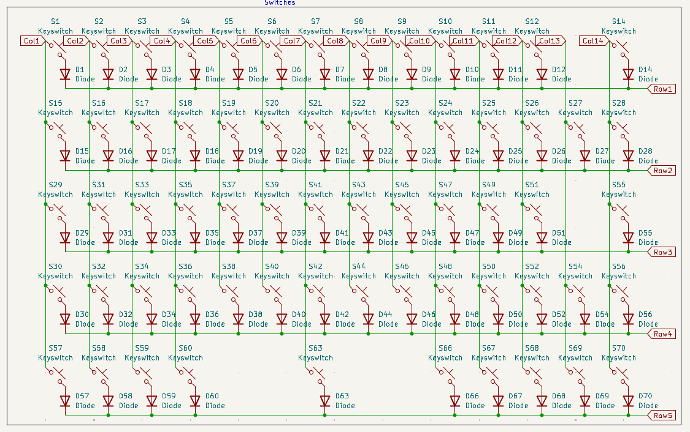

*1.5h* Once I figured out how to move the symbols on the right grid (drag them from the center pad), moving these around was pretty easy. Unfortunately I turned off the ratnest, and when I turned it back on realized the numbering was off. KiCad numbered my switches oddly when I copied and pasted on the schematic, so the last three rows of keys are all messed up. Problem for next time. 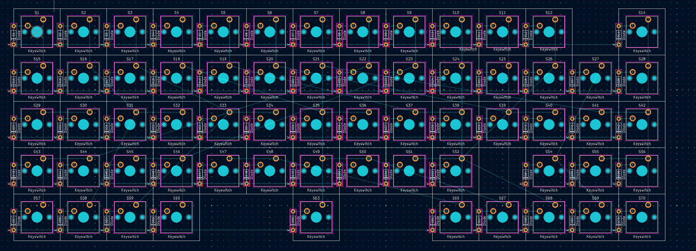

---

#### 7_19_2025 Schematic + PCB V2

*20m* Rewrote the schematic of the switches with the right numbering. I also realized I needed one more switch in the top row, so added that. Now that I know what I'm doing, it took a lot less time.
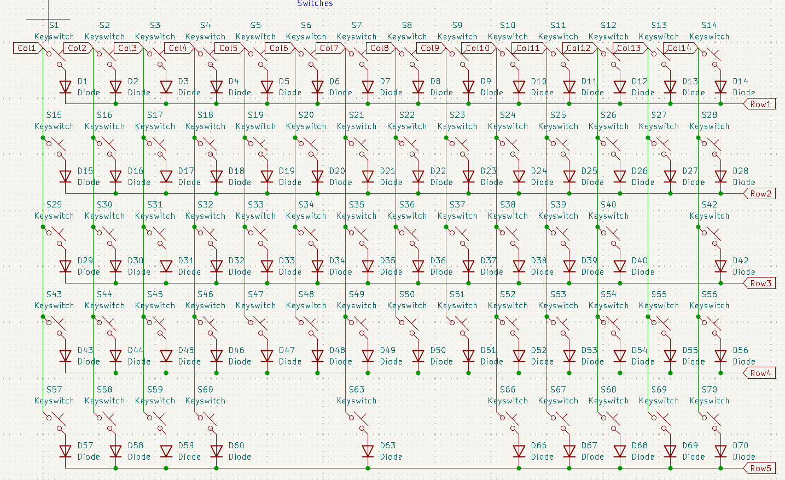

*4m* Updated the PCB and every switch moved to the right place! Only 13 and 53 needed to be placed. In this process I realized my original schematic was also missing switch 53, so placed that.

*20m* Change the key sizes  
I went through the schematic and changed the footprint key sizes. That's when I [found out](https://hirosarts.com/blog/keycap-dimensions-guide-for-beginners/?) that a 2.5u Shift and Caps Lock key is very hard to come by for ANSI keyboard keycap sets. I still want this pretty small, but I'll need a place for the Nano anyway, so I'm going to add the Nano to the PCB and see how the spacing works out.

*54m* Research controller boards  
This board needs bluetooth (esp32), enough pins, well-documented, and cheap. I could try a SEEED board but I'd like some arduino experience so I'm doing the Nano Esp32 with a step-up. There's also this image on one of the [docs](https://docs.arduino.cc/tutorials/nano-esp32/cheat-sheet/) showing a possible direct power from battery option. It needs EXACTLY 3.3v, though, and disables the usb-c power, so I guess I'd need a step-down in my schematic. I'll figure this out after - I know the Nano is the board I want.

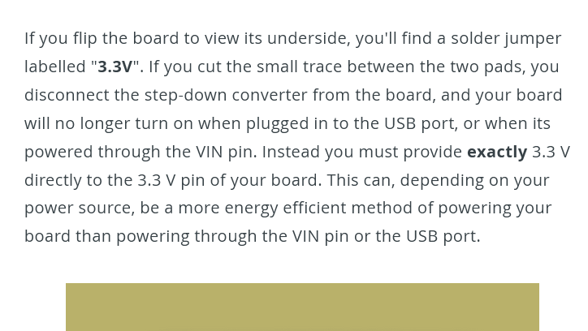

#### 7_20_2025 Schematic + PCB V3

*1.5h* Many of my keys are non-standard sizes, like the enter and caps lock which I made 2.5u. It's cheaper to buy ANSI keycaps, so I rewrote the board based on ANSI sizes. The arrows stick out, but I need a place for the board anyway so it's fine. New layout:
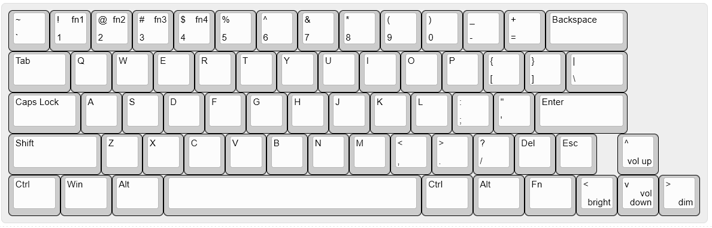

*1h* Researched some more, and found out the Nice!Nano V2 is a very popular chip for wireless boards. Read for a while about connecting it to batteries and such.

*3h* Sooo the Nice nano only has 18 GPIO pins and I have 14 columns + 5 rows = 19 pins needed. However, I only need 65 keys: 13*5. So I'm deleting the final row and moving the keys where I need them.
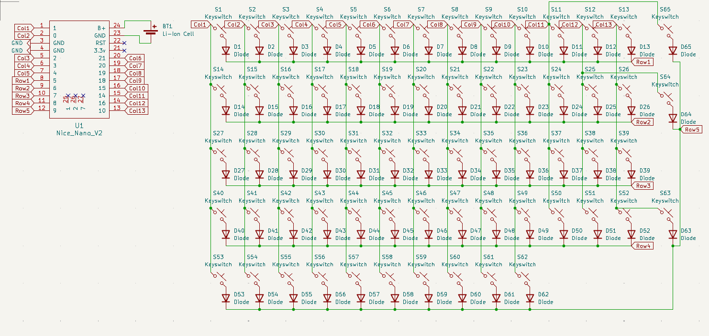

With 13 columns and 5 rows, I use all the pins. It took a while to route the individual keys, and tomorrow I'll finish by connecting lines to the board. Might need to shuffle around things to keep the rat's nest simpler.
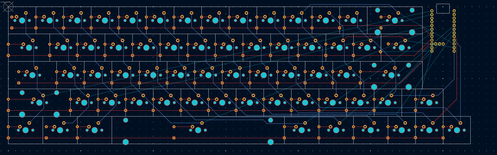

#### 7_23_2025

*20min* Connected ratsnest to the board. It's a bit messy - might be worth shifting around pins and things.

#### 7_23_2025 Finish PCB

*1h* Fixed the ratsnest. Gave the wires correct clearance and tightened up the edges of the PCB. The stabilizer holes on the backspace button are in a really annoying position, but got around them eventually.
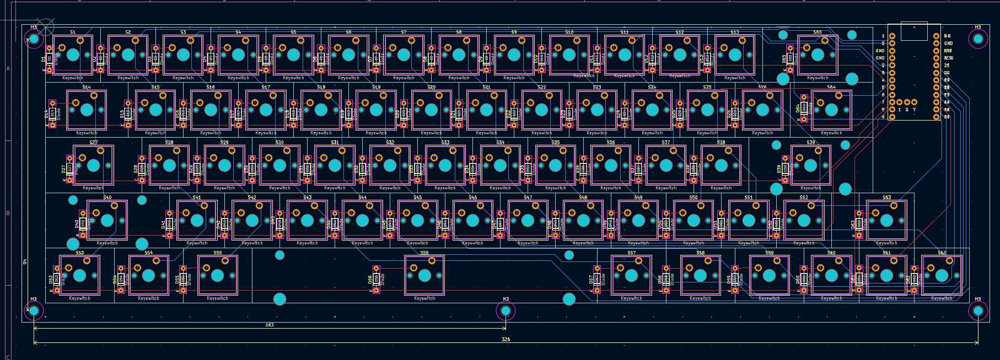

#### 7_27_2025 Finish CAD

*2h* Fought with the switch model for a while, trying to figure out configurations. The final switch model has a configuration for each size of keycap, which makes it easy to switch them around on the board design. Next time I try this it will go faster
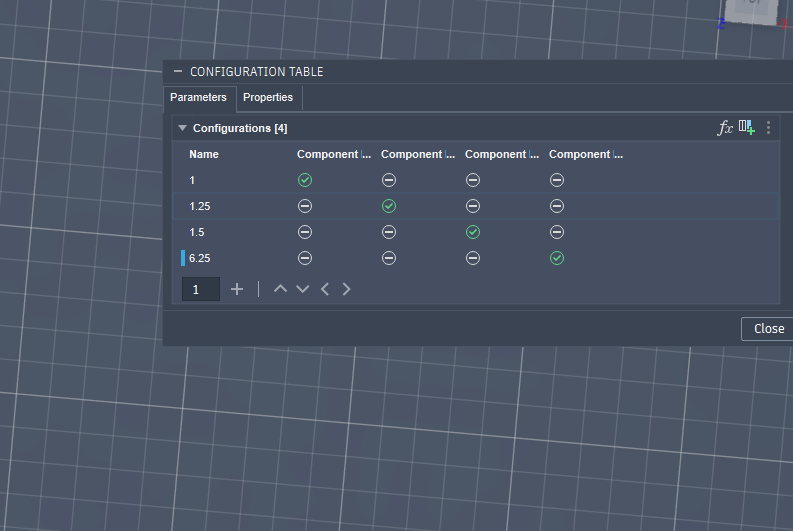

*1.5h* Making the base and lid was straightforward. Deciding on a height for the base took a bit - I used my completed macropad to estimate how high on the switch the base should be, then extruded it to that plane in F3D. The PCB sits on a little ledge + has 5 mounting holes.
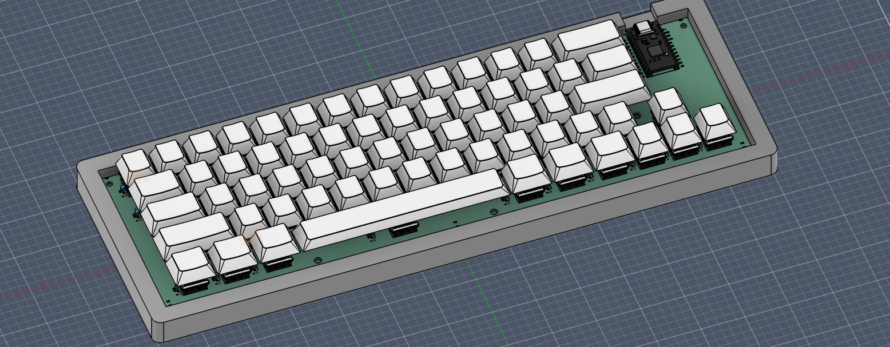

#### 7_28_2025 Completing

*1h* Realized the support ledge interfered with the Nano pins and a stabilizer, so went back and changed the sketch. Sometimes Fusion's history is very useful. Also added mounting holes: I'm using all M3 heatset mounts everywhere.

Added a ground plane (not connected to anything tho bc this is battery powered)

*1h* Recheck board, generate gerbers, put all my files in the repo

*45m* Create BOM and find all the parts.

*30m* Write Firmware

*45m* Finish Journal + Readme + submit project

#### 7_31_2025

*2h* Switched the case design to something that looks more like the original typewriters. Picked a set of tan keycaps to match.
Most of the work was getting the spline to extrude nicely over the supports. 
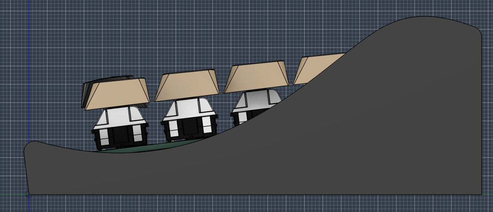

I tilted the board 7 degrees to make typing easier.
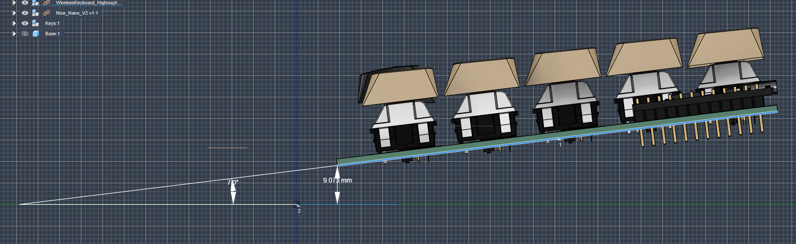

This is the final base I got, but feedback on the server was that it still isn't complex enough. Next move: add a plate and keep modifying the case. I think I'll need to completely rebuild the model.
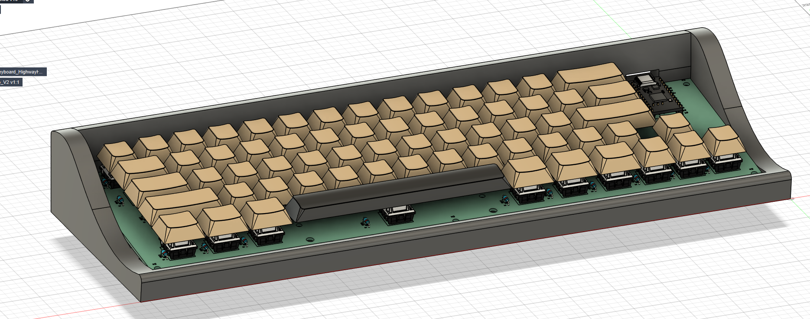

#### 8_8_2025

*4h* I rebuilt the case to use a plate mount instead of screwing the pcb in (left the pcb drill holes in case I change it in the future.) To rebuild the case, I started with a side profile and a base:
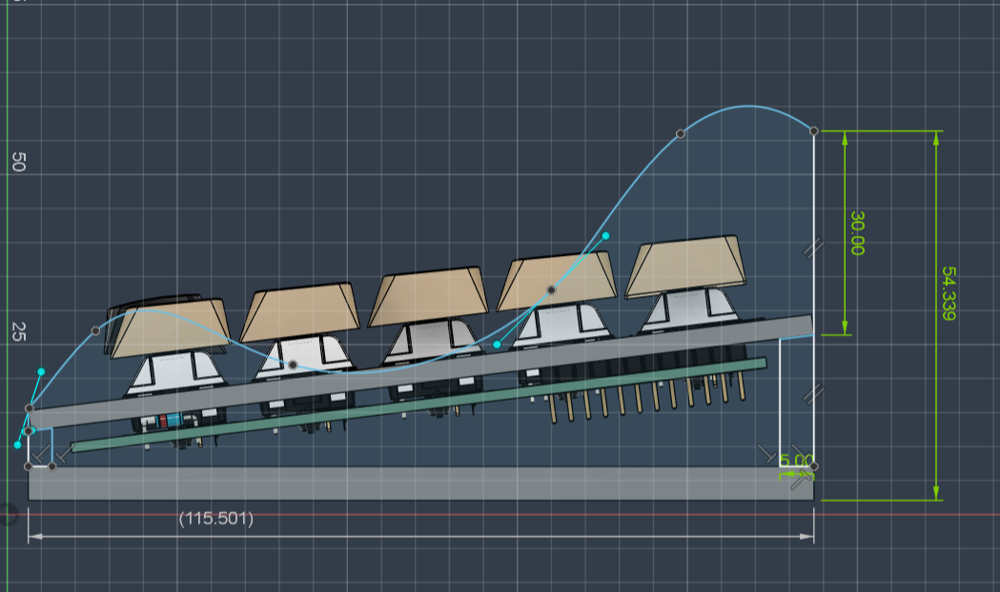

Off of this side profile, I designed a bottom base that supports the plate and has the decorative sides. 
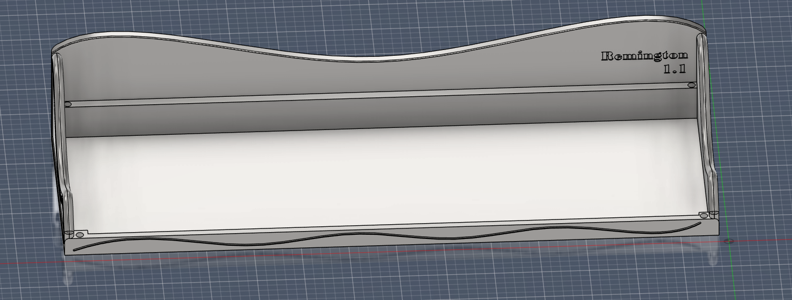
I watched this ScottoKeebs video to get an idea of how to design the plate: https://www.youtube.com/watch?v=7azQkSu0m_U

Then, I designed a plate that bolts in with M3 screws and inserts.  
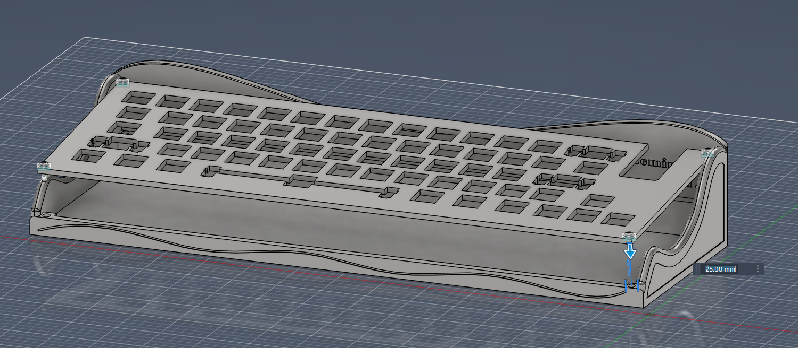

#### 8_15_2025

*30m* Added some quotes and a depressed profile on both sides. Left is Stephen King and right is Ernest Hemingway.  
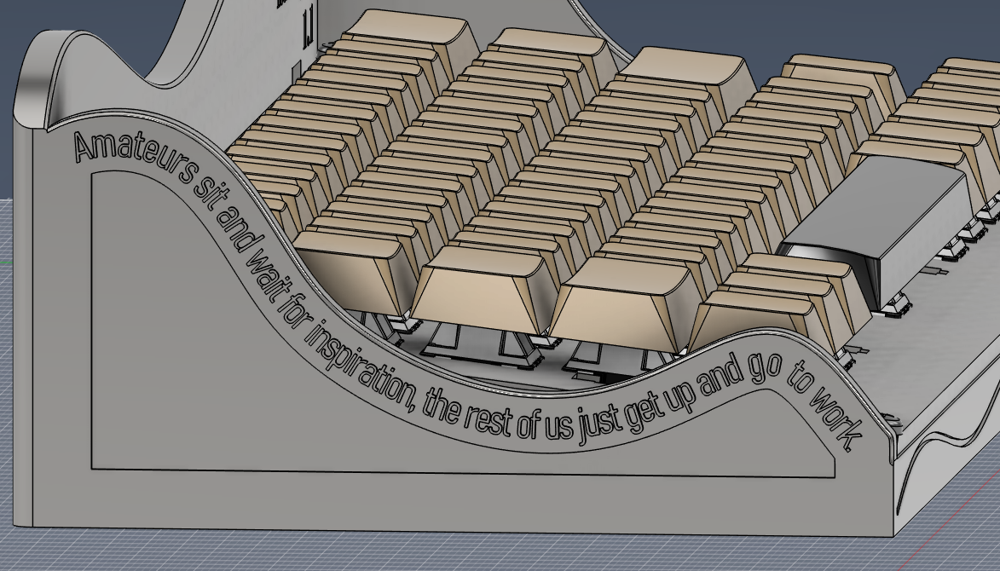  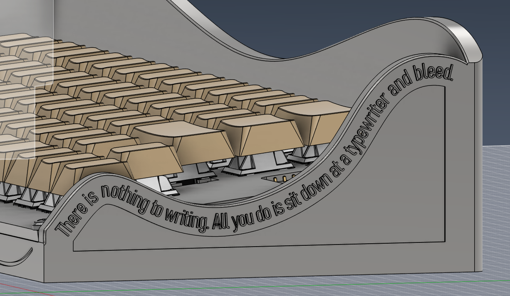

*30m* Catch up Journal and submit.

#### 9_17_2025

*15m* Find some SMD diodes that will work for cheap assembly from JLC (Part #C8598)
*30m* rewire the PCB with said diodes. They use a SOD-123 footprint.
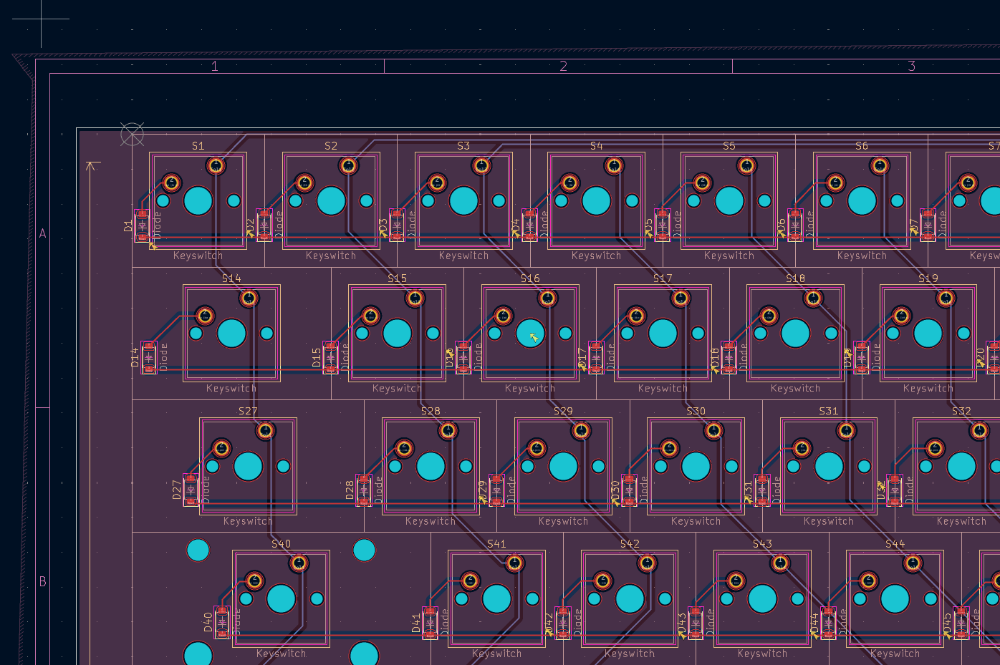

#### 9_20_2025

*2h* Figure out how to write a BOM and pick and place file from KiCad. I ended up using the defaults generated by KiCad, then uploaded those to KiCad after selecting "PCB Assembly." Then, I looked up the cheap Schottky diodes and replaced whatever was in the BOM with those, and selected DNP for everything else. I used 

It ended up being $15 more expensive than just soldering the diodes myself, so I'm not going to use these files. I'll stick with the old setup in the Production folder.

#### 9_23_2025

*20m*
* Check all BOM links and update prices
* find some decent headers for my Nano
* text my reviewer to check that adding headers to my BOM is good:
Changes:
> Added headers for
> Stabilizers can't be shipped, went from $2.96 to $6.68

*30m* Start ordering

#### 10_13_2025

*2hr* Begin build. I realized these keyswitches are three prong instead of 5 prong, so the plate will have to do the alignment and stabilization. The makerspace only has 3mm acrylic and the plate clips on the switches are 1.5mm so I need to figure out what to do there.

3d printed two different test pieces, to see how the switches and keycaps will fit. Realized my stabilizers don't fit the normal stabilizer hole, so I added a few mm on each side to let the stabs all the way through the plate. Lasered a test in 3mm acrylic and it worked.

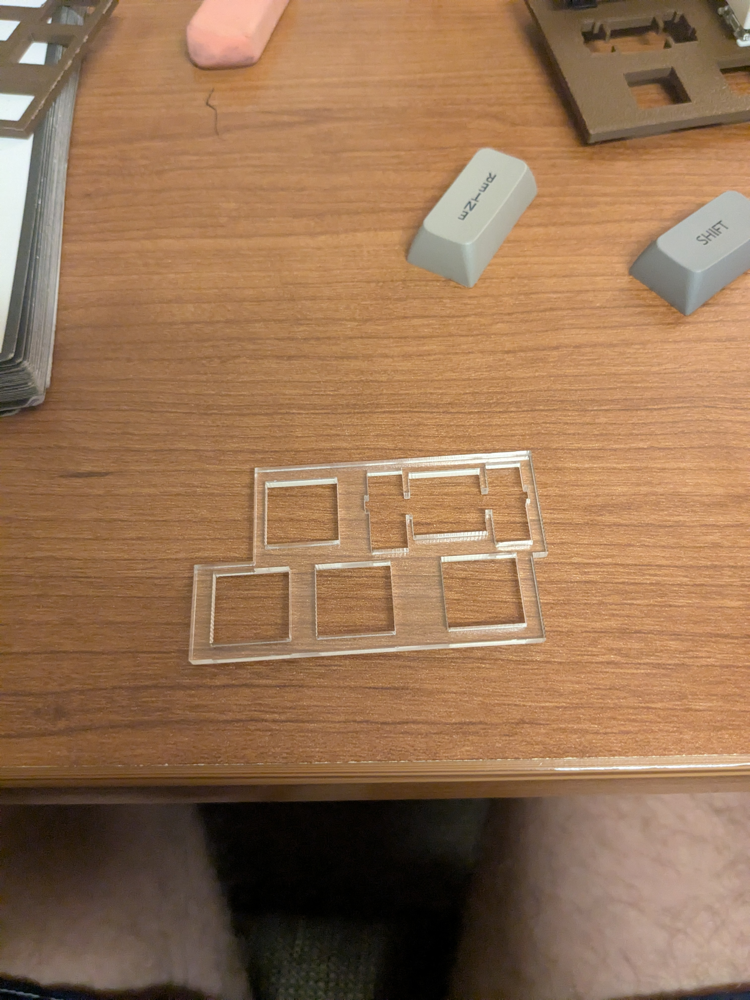
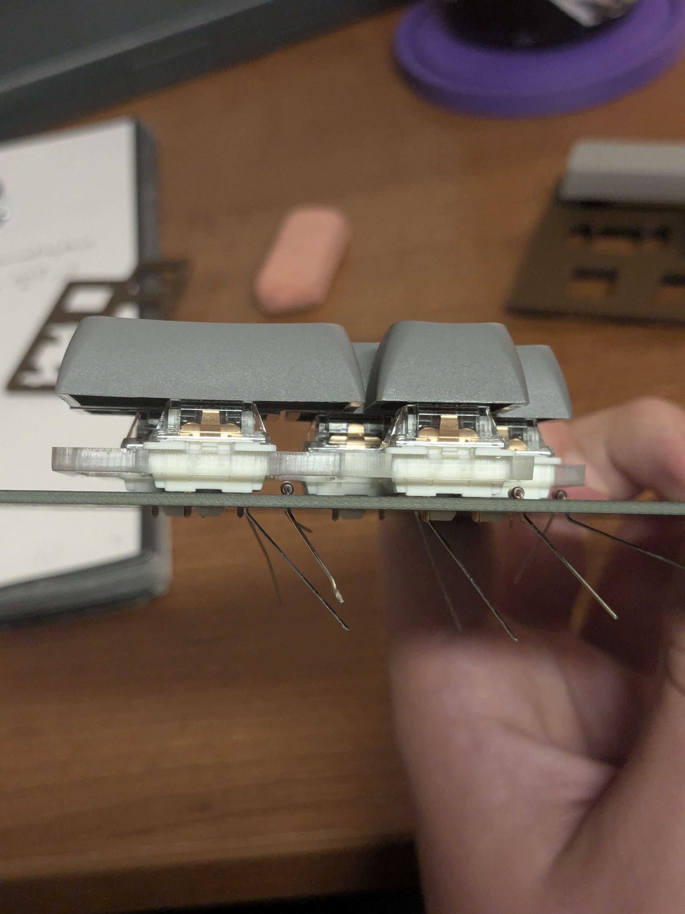
#### 10_14_2025

*1h* Start soldering in diodes on the board.

#### 10_15_2025

*3h* Laser the full plate (with extended stab holes), solder in some of the switches. Keeping them flush while soldering is hard, I'm soldering some in, then holding the board upright and remelting the solder to shove the switch in more.

#### 10_16_2025

*2h* Finished soldering in all the switches

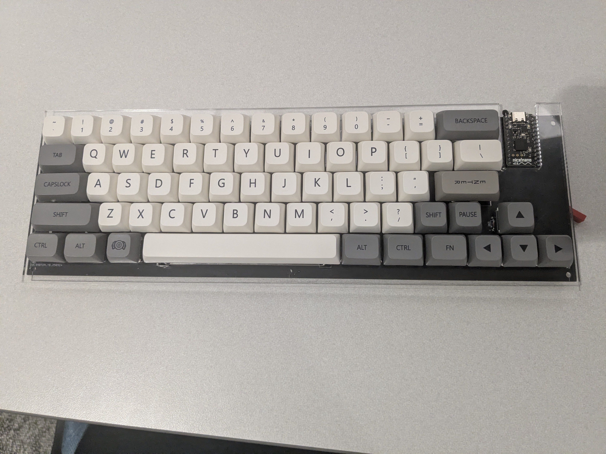

*1h* Fought with a JST RCY connector to get the battery connected to the NiceNanov2
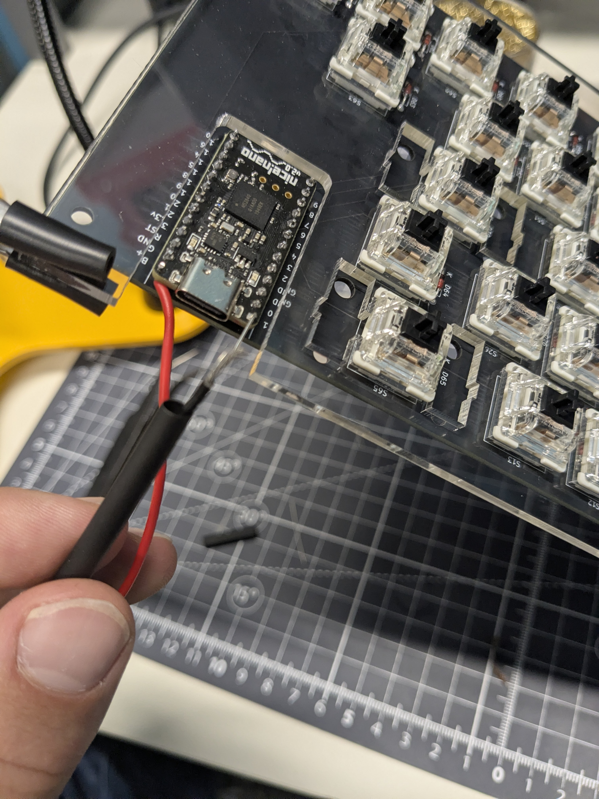

#### 10_20_2025

*1h* Tried to write the firmware. Using AI bc ZMK docs are confusing

*1h* Fixed the code bc the AI can't write keymaps or shields. Got a custom shield written

#### 10_21_2025

*20m* Fixed the keymap and finished the build process. Ready to flash the keeb