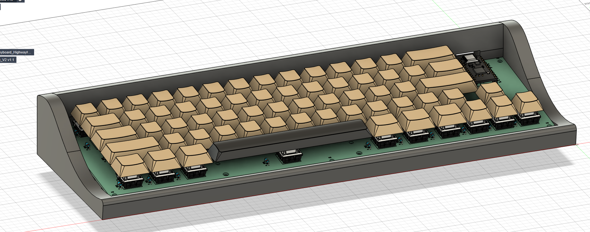
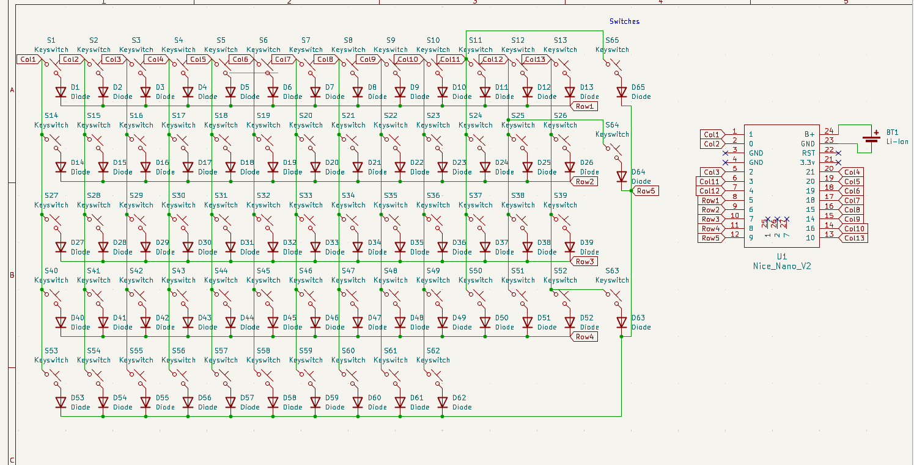
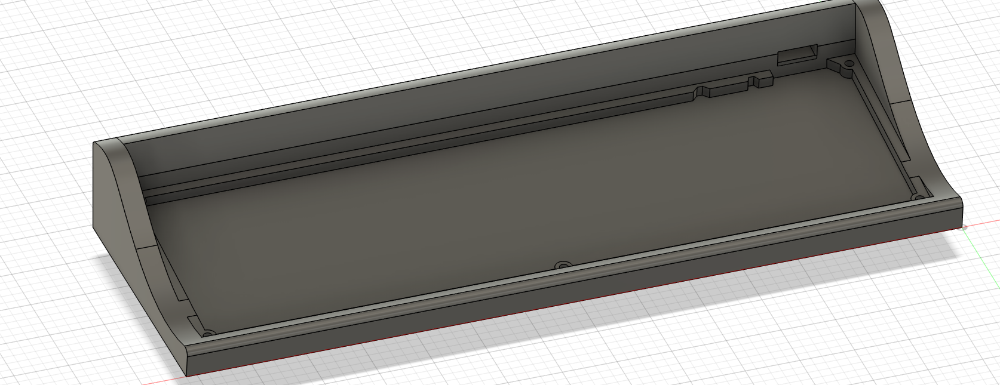
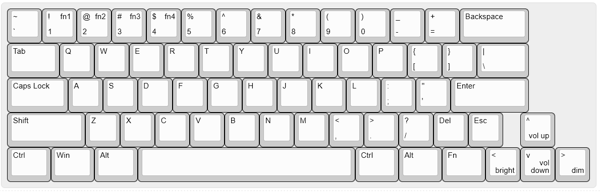

!

The Remington #2 was the first typewriter with "macros" - it typed lowercase or uppercase based on whether the user was holding the Shift key. This modern, battery powered keyboard is much smaller and more portable than that original typewriter, but has lost a key. Since this layout is missing the right Shift, it's a version before the Remington #2 - the Remington #1.1

I built this to have a keyboard to use in college. Since it's battery powered, I can throw it in my backpack and use it wherever I'm studying.

> Resubmit Changes:
>
> * Designed a new base to look like a typewriter
> * Found a set of keycaps in a color scheme closer to a typewriter
> * Added headers to the BOM

### BOM

| Item                    | Qty | Price USD (including shipping) | Link                                                                 |
|-------------------------|-----|-------------------------------|----------------------------------------------------------------------|
| Gateron Red Switches x65 | 1   | $21.34                       | https://www.aliexpress.us/item/3256805364014141.html       |
| Keycaps x65             | 1   | $7.83                         | https://www.aliexpress.us/item/3256807958489968.html        |
| PCB                     | 1   | $29.81                        | JLCPCB                                                              |
| Diodes x65              | 1   | $1.45                         | https://www.aliexpress.us/item/3256803242364455.html        |
| Nice!Nano V2            | 1   | $25.00                        | https://typeractive.xyz/products/nice-nano                  |
| Stabilizers             | 1   | $2.96                         | https://www.aliexpress.us/item/3256802930868859.html        |
| 3D Printed Case         | 1   | Free                          | Self-printed                                                        |
| 601230 3.7V 200mAh Battery | 1 | 12.39                        | https://www.aliexpress.us/item/2251832650224851.html        |
| M3 Heatset Inserts      | 1   | $4.62                         | https://www.aliexpress.us/item/3256804442999990.html        |

Total: $105.40 USD

### Schematic

### PCB

### CAD
Base

### Key Layout

